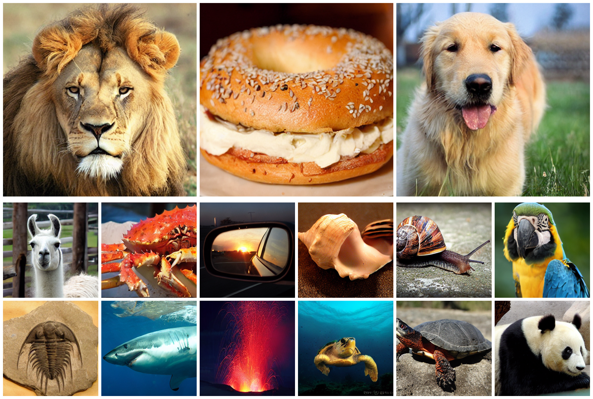

## Master Practical of Image and Video Synthesis  <br><sub>**Research of Diversity of SiT**</sub>
[Our Report Paper](https://arxiv.org/pdf/2401.08740.pdf)



This repository extends the original [Scalable Interpolant Transformer (SiT)](https://arxiv.org/abs/2401.08740) project to **systematically evaluate the diversity** of generated images using various perceptual and statistical metrics. Our practical focuses on **benchmarking and analyzing SiT under different sampling settings** (SDE/ODE, CFG, noise levels, etc.), and includes tools for evaluating:

- **FID / sFID**
- **Inception Score**
- **Precision & Recall**
- **LPIPS (perceptual diversity)**
- **DreamSim Distance**
- **DINOv2 Similarity**
- **CLIP-based Feature Diversity**

## ✅ Project Goals

**We aim to answer:**

> 1. How do different sampling settings and interpolation parameters affect the diversity of samples generated by SiT?
> 2. 
> 3. 

To achieve this, we implemented a comprehensive evaluation pipeline that measures both **intra-class** and **inter-class** diversity.


---
## 📂 Folder Structure

<summary><strong>📂 Folder Structure</strong></summary>

```text
├── SiT         # Original Implementation of SiT
├── diversity_metrics/      
│   ├── compute_fid.py  
│   ├── eval.py  
│   └── metrics.py   
├── validation_loss/               
└── vis/               
        
```
---


## 🔧 Setup

Clone the repo and create the environment:

```bash
git clone https://github.com/willisma/SiT.git
cd SiT
conda env create -f environment.yml
conda activate SiT

# Generate samples across multiple classes
torchrun --nproc_per_node=4 sample_ddp.py ODE --model SiT-XL/2 --num-fid-samples 10000

# Compute metrics from saved samples
python diversity_metrics/run_metrics.py --input-dir path/to/samples

##Visualizing Diversity
python diversity_metrics/vis_intra.py --csv-dir results/metrics --save-dir outputs/
```
---


## Experiment Results

NEED TO BE ADDED
