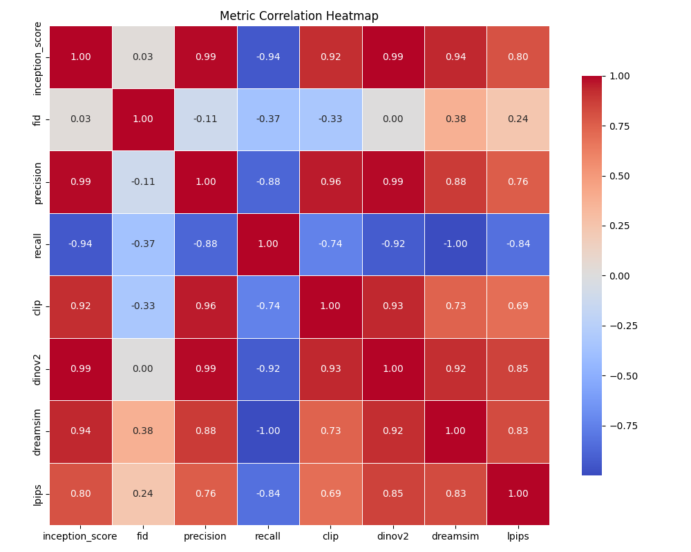

## Master Practical of Image and Video Synthesis  <br><sub>**Research of Diversity of SiT**</sub>
[Our Report Paper](https://arxiv.org/pdf/2401.08740.pdf)


This repository extends the original [Scalable Interpolant Transformer (SiT)](https://arxiv.org/abs/2401.08740) project to **systematically evaluate the diversity** of generated images using various perceptual and statistical metrics. Our practical focuses on **benchmarking and analyzing SiT under different sampling settings** (SDE/ODE, CFG, noise levels, etc.), and includes tools for evaluating:


---
## 📂 Folder Structure

<summary><strong>📂 Folder Structure</strong></summary>

```text
├── SiT         # Original Implementation of SiT
├── diversity_metrics/   # Implementation of Diversity Metric and Evaluation of (FID, sFID, Inception Score,Recall, Precision)   
│   ├── compute_fid.py   # Provided by our supervisor Johannes Schusterbauer
│   ├── eval.py  
│   └── metrics.py   
│   
│── exp-final/    # Experiment Results stored in this File
│   ├── 1.number_dependency/
│   ├── 2.cfg_comparison/ 
│   ├── 3.sde_comparison/
│   ├── 4.cfg_interval_study/
│   ├── tradeoff/
│   ├── metric_correlation_heatmap.png 
│   └── valloss_vs_samples.png
│        
└── validation_loss/         
        
```
---


## 🔧 Run
### 1. Clone Repository and Set Up Environment

```bash
git clone https://github.com/77Han329/CVPractical.git
cd CVPractical

conda env create -f environment.yml
conda activate CVpractical
```
### 2. Download Pre-Sampled Data
To evaluate the diversity of the SiT-XL/2 model using metrics such as LPIPS, DreamSim, CLIP, and DINO, you need to download the following pre-generated samples:

👉 [Download Presampled Data (CFG=1.0, ODE)](https://github.com/77Han329/CVPractical/releases/download/sit-samples-v1/SiT-XL-2-pretrained-cfg-1.0-4-ODE-250-euler.npz.zip)

- **Model**: `SiT-XL/2`
- **Config**: `CFG=1.0`
- **Sampler**: `ODE`
- **Format**: `.npz`
- **Number**: `1000`

After download, unzip the file and place it at the project root or under a preferred directory.

### 3. Run Diversity Evaluation
Once the sample file is ready, run:
```bash
cd diversity_metrics
python eval.py python eval.py --sample_batch "your_sample_batch_directory" --metric clip --batch_size 5 
```

The resulting `diversity_metrics_results.csv` includes the following fields:

- **setting**: cfg-1.0-ODE  
- **path**: directory of `.npz` sample  
- **metric**: clip  
- **batch_size**: 5  
- **seed**: (random seed used)  
- **feature_type**: cls_token  
- **mean**: (diversity score mean)  
- **std**: (diversity score std deviation)

### 4. Download Ref-Batch Data
To evaluate (FID, sFID, Inception Score, Precision and Recall), you need to download following reference batch

👉 [Download Reference Batch (ImageNet 256x256)](https://github.com/77Han329/CVPractical/releases/download/sit-ref/VIRTUAL_imagenet256_labeled.npz.zip)

After download, unzip the file and place it at the project root or under a preferred directory.

### 5. Run Evaluation

Once the ref file is ready, run:
```bash
cd diversity_metrics
python eval.py python compute_fid.py --ref_batch "your_ref_batch_directory" --sample_batch "your_sample_batch_directory"
```

---

## 🧪 Experiment Results

The folder `exp-final/` contains visualizations from multiple experiments evaluating sampling strategies, diversity trade-offs, and metric behavior.

<details>
<summary><strong>1️⃣ Number Dependency</strong></summary>

📁 `exp-final/1.number_dependency/`  
  


This Results includes experiments examining how the number of samples impacts diversity and metric stability.

</details>

<details>
<summary><strong>2️⃣ CFG Comparison</strong></summary>

📁 `exp-final/2.cfg_comparison/`  
This comparison explores the effects of varying CFG (classifier-free guidance) scales on generation quality and diversity.2.cfg_comparison
/div_cfg.png


</details>

<details>
<summary><strong>3️⃣ SDE vs ODE Comparison</strong></summary>

📁 `exp-final/3.sde_comparison/`  

This study compares sample diversity and realism between stochastic (SDE) and deterministic (ODE) sampling.

</details>

<details>
<summary><strong>4️⃣ CFG Interval Study</strong></summary>

📁 `exp-final/4.cfg_interval_study/`  


Investigates whether finer-grained CFG sampling intervals yield better performance.

</details>

<details>
<summary><strong>5️⃣ Trade-off Experiments</strong></summary>

📁 `exp-final/tradeoff/`  

Contains ablation studies on diversity-quality trade-offs, including various sampling configurations.

</details>

<details>
<summary><strong>📊 Metric Correlation Heatmap</strong></summary>

  
This heatmap shows the correlation between metrics such as FID, LPIPS, DreamSim, and CLIP.

</details>

<details>
<summary><strong>📈 Validation Loss vs Sample Size</strong></summary>

  
Depicts how validation loss varies with number of samples, confirming the stability of model evaluation.

</details>

---

## 📦 Pre-Sampled Outputs

We provide pre-generated sample outputs of the SiT-XL/2 model for reproducibility and metric evaluation.

👉 [Download Sample Output (CFG=1.0, ODE)](https://github.com/77Han329/CVPractical/releases/download/sit-samples-v1/SiT-XL-2-pretrained-cfg-1.0-4-ODE-250-euler.npz.zip)

- Model: `SiT-XL/2`
- Config: `CFG=1.0`
- Sampler: `ODE`
- Format: `.npz`
- Number: `1000`

---

## 🙏 Acknowledgements

We would like to thank our supervisor **Johannes Schusterbauer** for his invaluable support throughout the project. In particular, he provided the implementation of `compute_fid.py`, which enables comprehensive evaluation of generative diversity through FID, sFID, Inception Score, Precision, and Recall.

